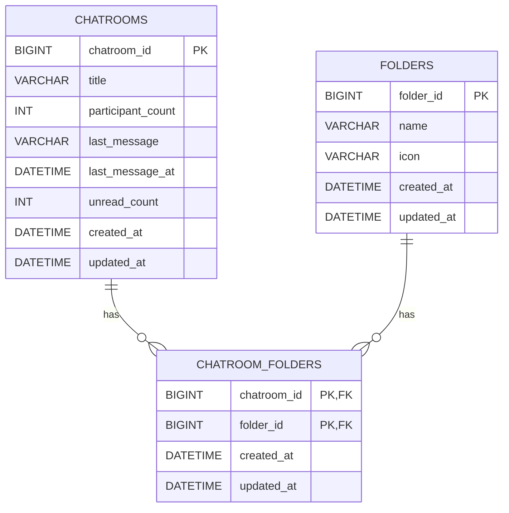

# 데이터베이스 스키마

이 문서는 채팅방 폴더 기능 구현의 기준이 되는 ERD와 데이터베이스 스키마를 정리한다.
현재 DDL은 ERDCloud import를 위한 참고용이며, 실제 JPA 엔티티 구현 방식은 이후 기능 개발
단계에서 확정한다.

## ERD



## 테이블 설명

### chatrooms

채팅방 목록에 노출되는 채팅방 정보를 저장한다.

| 컬럼 | 타입 | 제약 조건 | 설명 |
| --- | --- | --- | --- |
| `chatroom_id` | `BIGINT` | PK, AUTO_INCREMENT | 채팅방 고유 ID |
| `title` | `VARCHAR(100)` | NOT NULL | 채팅방 이름, 최대 100자 |
| `participant_count` | `INT` | NOT NULL, CHECK >= 1 | 채팅방 참여자 수 |
| `last_message` | `VARCHAR(500)` | NULL | 채팅방의 마지막 메시지 |
| `last_message_at` | `DATETIME` | NULL, INDEX | 마지막 메시지가 발송된 시각 |
| `unread_count` | `INT` | NOT NULL, DEFAULT 0, CHECK >= 0 | 읽지 않은 메시지 수 |
| `created_at` | `DATETIME` | NOT NULL | 생성 시각 |
| `updated_at` | `DATETIME` | NOT NULL | 수정 시각 |

### folders

사용자가 채팅방을 분류하기 위해 사용하는 폴더 정보를 저장한다.

| 컬럼 | 타입 | 제약 조건 | 설명 |
| --- | --- | --- | --- |
| `folder_id` | `BIGINT` | PK, AUTO_INCREMENT | 폴더 고유 ID |
| `name` | `VARCHAR(30)` | NOT NULL, UNIQUE, CHECK | 폴더 이름, 최대 30자 |
| `icon` | `VARCHAR(50)` | NOT NULL, CHECK | 폴더 아이콘 식별값, 최대 50자 |
| `created_at` | `DATETIME` | NOT NULL | 생성 시각 |
| `updated_at` | `DATETIME` | NOT NULL | 수정 시각 |

`name`은 아래 값만 허용한다.

- `SOPT`
- `FAMILY`
- `FRIENDS`
- `PART_TIME`

`icon`은 아래 값만 허용한다.

- `ICON_STUDENT`
- `ICON_HEART`
- `ICON_COFFEE`
- `ICON_BRIEFCASE`

### chatroom_folders

채팅방과 폴더의 매핑 정보를 저장한다. 하나의 채팅방은 여러 폴더에 포함될 수 있고,
하나의 폴더는 여러 채팅방을 포함할 수 있다.

| 컬럼 | 타입 | 제약 조건 | 설명 |
| --- | --- | --- | --- |
| `chatroom_id` | `BIGINT` | PK, FK, ON DELETE CASCADE | 매핑된 채팅방 ID |
| `folder_id` | `BIGINT` | PK, FK, ON DELETE CASCADE, INDEX | 매핑된 폴더 ID |
| `created_at` | `DATETIME` | NOT NULL | 생성 시각 |
| `updated_at` | `DATETIME` | NOT NULL | 수정 시각 |

## 관계 설명

- `chatrooms`와 `chatroom_folders`는 1:N 관계이다.
- `folders`와 `chatroom_folders`는 1:N 관계이다.
- `chatroom_folders`는 `chatroom_id`, `folder_id`를 복합 PK로 두는 현재 설계를 기준으로 한다.
- `chatrooms` 또는 `folders` row가 삭제되면 연결된 `chatroom_folders` row도 함께 삭제된다.
- JPA 구현 시에는 `chatroom_folders`를 단순 `@ManyToMany`가 아닌 연결 엔티티로 관리하는 방향을
  우선 검토한다.

## 인덱스

| 인덱스 | 테이블 | 컬럼 | 목적 |
| --- | --- | --- | --- |
| `IDX_CHATROOMS_LAST_MESSAGE_AT` | `chatrooms` | `last_message_at DESC` | 최근 메시지 시각 기준 채팅방 정렬 최적화 |
| `IDX_CHATROOM_FOLDERS_FOLDER_ID` | `chatroom_folders` | `folder_id` | 폴더 기준 채팅방 매핑 조회 최적화 |

## 참고용 DDL

아래 DDL은 ERDCloud import와 스키마 공유를 위한 참고용이다.

```sql
CREATE TABLE `folders` (
    `folder_id`  BIGINT       NOT NULL AUTO_INCREMENT,
    `name`       VARCHAR(30)  NOT NULL,
    `icon`       VARCHAR(50)  NOT NULL,
    `created_at` DATETIME     NOT NULL,
    `updated_at` DATETIME     NOT NULL,

    CONSTRAINT `PK_FOLDERS` PRIMARY KEY (`folder_id`),
    CONSTRAINT `UK_FOLDERS_NAME` UNIQUE (`name`),

    CONSTRAINT `CHK_FOLDERS_NAME`
        CHECK (`name` IN ('SOPT', 'FAMILY', 'FRIENDS', 'PART_TIME')),

    CONSTRAINT `CHK_FOLDERS_ICON`
        CHECK (`icon` IN ('ICON_STUDENT', 'ICON_HEART', 'ICON_COFFEE', 'ICON_BRIEFCASE'))
);

CREATE TABLE `chatrooms` (
    `chatroom_id`       BIGINT        NOT NULL AUTO_INCREMENT,
    `title`             VARCHAR(100)  NOT NULL,
    `participant_count` INT           NOT NULL,
    `last_message`      VARCHAR(500)  NULL,
    `last_message_at`   DATETIME      NULL,
    `unread_count`      INT           NOT NULL DEFAULT 0,
    `created_at`        DATETIME      NOT NULL,
    `updated_at`        DATETIME      NOT NULL,

    CONSTRAINT `PK_CHATROOMS` PRIMARY KEY (`chatroom_id`),
    CONSTRAINT `CHK_CHATROOMS_PARTICIPANT_COUNT` CHECK (`participant_count` >= 1),
    CONSTRAINT `CHK_CHATROOMS_UNREAD_COUNT`      CHECK (`unread_count` >= 0)
);

CREATE TABLE `chatroom_folders` (
    `chatroom_id` BIGINT   NOT NULL,
    `folder_id`   BIGINT   NOT NULL,
    `created_at`  DATETIME NOT NULL,
    `updated_at`  DATETIME NOT NULL,

    CONSTRAINT `PK_CHATROOM_FOLDERS` PRIMARY KEY (`chatroom_id`, `folder_id`),

    CONSTRAINT `FK_CHATROOMS_TO_CHATROOM_FOLDERS`
        FOREIGN KEY (`chatroom_id`) REFERENCES `chatrooms` (`chatroom_id`)
        ON DELETE CASCADE,

    CONSTRAINT `FK_FOLDERS_TO_CHATROOM_FOLDERS`
        FOREIGN KEY (`folder_id`) REFERENCES `folders` (`folder_id`)
        ON DELETE CASCADE
);

CREATE INDEX `IDX_CHATROOMS_LAST_MESSAGE_AT`  ON `chatrooms` (`last_message_at` DESC);
CREATE INDEX `IDX_CHATROOM_FOLDERS_FOLDER_ID` ON `chatroom_folders` (`folder_id`);
```
